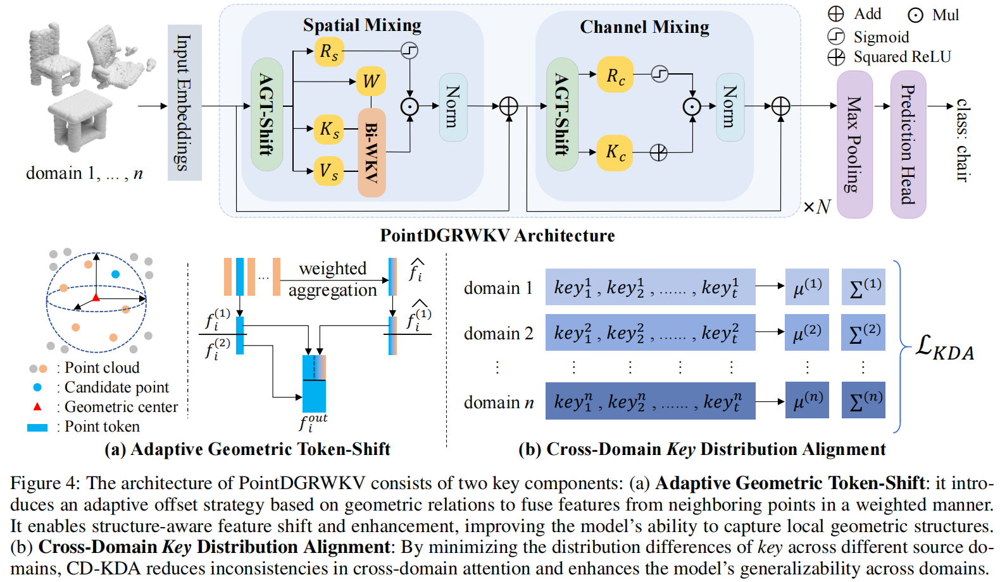
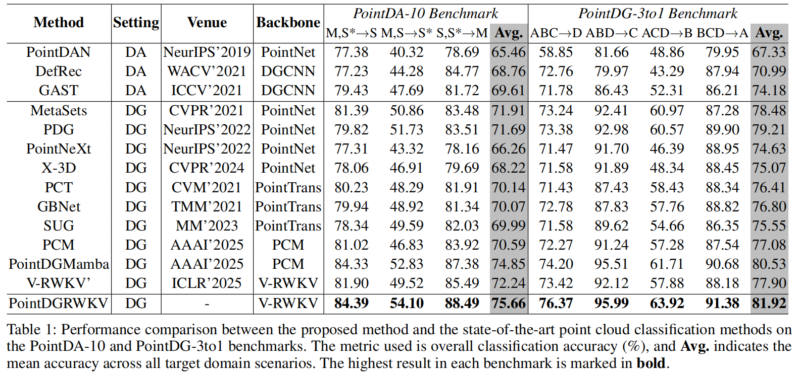

# PointDGRWKV: Generalizing RWKV-like Architecture to Unseen Domains \\for Point Cloud Classification


## 1. Overview



## 2. Performance



## Cite

If you use PointDGRWKV in your research, please use the following BibTeX entry.

```
@article{yang2025pointdgrwkv,
      title={PointDGRWKV: Generalizing RWKV-like Architecture to Unseen Domains for Point Cloud Classification}, 
      author={Yang, Hao and Zhou, Qianyu and Sun, Haijia and Li, Xiangtai and Liu, Xuequan and Ma, Lizhuang and Yan, Shuicheng},
      journal={arXiv preprint arXiv:2508.13574},
      year={2025}
}
```

